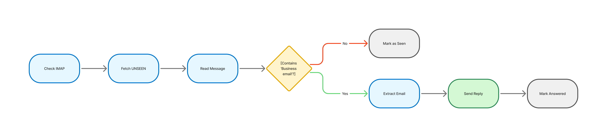

# Asterion Email Autoresponder



Asterion Email Autoresponder is a lightweight Python service that automatically acknowledges incoming business enquiries by scanning message bodies, extracting declared contact addresses, and sending threaded, professional replies. Built for reliability: charset-aware parsing, HTML fallback, anti-loop safeguards, configurable templates, and a safe test mode.

## Features

- IMAP/SMTP based auto-reply flow
- Robust parsing: text/plain and HTML fallback
- Safeguards: `Auto-Submitted` & `Precedence` checks and sender validation
- Threaded replies (In-Reply-To set)
- Test mode to avoid sending real emails during development
- Streamlit UI to view status and flowchart (optional)
- Docker-ready and CI scaffolded

## Quickstart

1. Clone the repository.
2. Copy `.env.example` to `.env` and set `OUTLOOK_USERNAME` and `OUTLOOK_APP_PASSWORD`.
3. (Optional) enable `TEST_MODE=true` while testing.
4. Install dependencies:
```bash
pip install -r requirements.txt
```
5. Run locally:
```bash
python improved_auto_reply.py
```
or to launch the simple UI:
```bash
streamlit run app.py
```

## Docker

Build and run:
```bash
docker build -t asterion-email-autoresponder .
docker run --env-file .env asterion-email-autoresponder
```

## Repository Contents

- `improved_auto_reply.py` — core service script
- `app.py` — simple Streamlit launcher and flowchart viewer
- `flowchart_colored.mmd` — mermaid source of the flowchart
- `flowchart_colored.png` — rendered diagram (included)
- `Dockerfile`, `requirements.txt`, `.env.example`, `.gitignore`
- `.github/workflows/ci.yml`, `.github/dependabot.yml`
- `tests/` — pytest scaffold
- `LICENSE` — MIT (Floyd Steev Santhmayer)
- `CONTRIBUTING.md` — contributor guidelines

## Contributing

See `CONTRIBUTING.md` for the code of conduct, contribution workflow, and testing guidelines.

## License

This project is released under the MIT License. See `LICENSE` for details.
